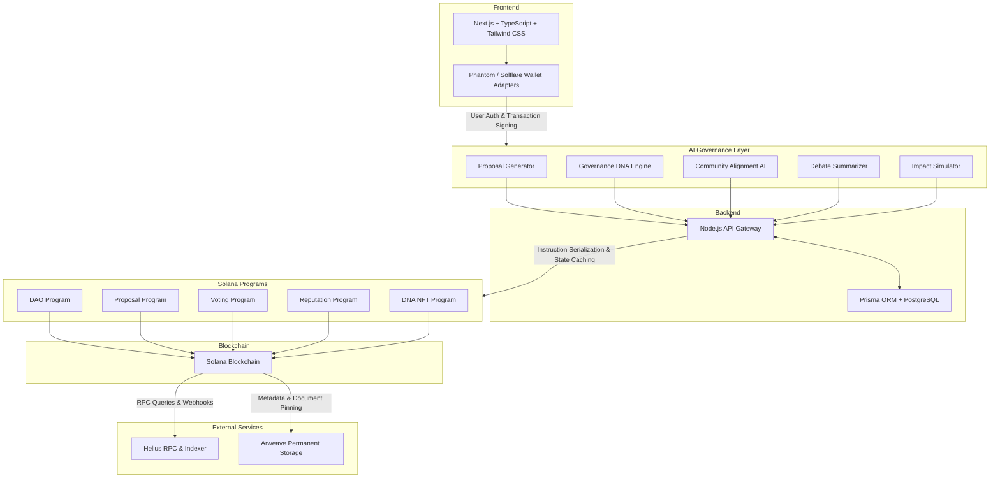
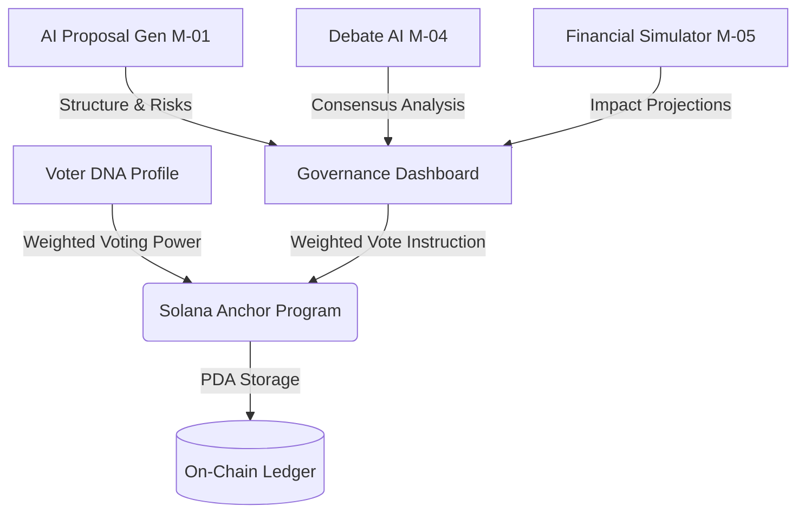

# 🧬 DNA DAO — Decentralized AI Governance Ecosystem

DNA DAO is a premium, high-fidelity decentralized autonomous organization platform powered by Solana smart contracts, AI-driven proposal engines, organic genetic member profiling, and a gorgeous glassmorphic fluid UI.

This platform bridges quantitative member personality profiles (DNA) with dynamic weighted voting power, debate intelligence summaries, and on-chain governance execution.

---

## 🎨 Premium Visual System
DNA DAO implements a state-of-the-art **Ivory-Emerald Glassmorphic UI** featuring:
* **Organic Gooey Metaball Background**: Custom SVG Gaussian blur and Color Matrix filter rendering fluid liquid spheres that morph, overlap, and merge organically like a liquid lava lamp behind the interface.
* **Glassmorphic Panels**: High backdrop blurs (`16px-24px`) and translucent backings (`rgba(255,255,255,0.72)`) overlaying the gooey liquid core.
* ** आउटफिट (Outfit) Typography**: Geometric structure with Outfit and Plus Jakarta Sans text formatting.
* **Pixel-Perfect Logo Recreation**: A beautiful vertical green-to-cyan gradient helix emblem featuring a 3D-depth overlapping strand cut.

---

## 🏛️ AI-Powered Solana Governance Architecture

The following diagram illustrates the complete end-to-end multi-tier architecture of DNA DAO, showing the flow from client wallets through our AI governance suite, the backend sync layer, on-chain Solana programs, and decentralized storage providers.



### Architectural Component Breakdown:

1. **Frontend**: The user interface is built using a modern React & Next.js stack with Tailwind CSS styling and custom glassmorphism. It uses Solana wallet adapters (Phantom, Solflare, etc.) to authenticate users and sign on-chain transactions.
2. **AI Governance Layer**: A suite of specialized AI modules:
   * **Proposal Generator**: Creates structured, professional proposals including problem statements, solutions, dynamic risk scores, budget structures, and execution timelines.
   * **Governance DNA Engine**: Indexes community members and visualizes their quantitative traits (Innovation, Risk Appetite, Community Focus, Financial Vision).
   * **Community Alignment AI**: Analyzes community sentiment and alignment.
   * **Debate Summarizer**: Condenses conversational forum threads to output consensus scores and argument breakdowns.
   * **Impact Simulator**: Models the long-term impact on the treasury balance, network growth, and community alignment.
3. **Backend API (Node.js)**: Orchestrates requests between the AI layer, database state caching (Prisma/PostgreSQL), and Solana network nodes.
4. **Solana Programs**: Custom on-chain Rust smart contracts using the Anchor framework that manage decentralized identity (DNA NFTs), DAO metadata, proposal lifecycle state, vote weighing, and member reputation.
5. **Solana Blockchain**: The decentralized state ledger processing high-speed, secure consensus transactions.
6. **External Services**:
   * **Helius**: Delivers high-performance RPC connections, transaction indexing, and webhook services.
   * **Arweave**: Provides decentralized, permanent storage for rich-text proposals, profile data, and media assets.

---

## 📐 Platform Architecture & Modules

The platform is designed around a highly adjustable, modular architecture called the **DNA Engine**:



### Core Modules:
* **`M-01` — AI Proposal Generator**: Creates structured, professional proposals including problem statements, solutions, dynamic risk scores, budget structures, and execution timelines in a single click.
* **`M-02` — DNA Member Profiling**: Indexes community members and visualizes their quantitative traits (Innovation, Risk Appetite, Community Focus, Financial Vision) using a dynamic, interactive SVG Radar Hexagon Chart.
* **`M-04` — AI Debate consensus Analyzer**: Analyzes conversational forum threads to output consensus scores, argument breakdowns, and structured deployment recommendations.
* **`M-05` — Financial & Risk Simulator**: Models the long-term impact on the treasury balance, network growth, and community alignment based on sliding budget and duration inputs.
* **`M-06 / M-07` — Weighted Voting & Transaction Feed**: Computes reputation-weighted voting power using quantitative DNA traits and logs real-time transactions both locally and on-chain.

---

## 🔒 Solana Anchor Smart Contract

The core on-chain state machine is built in Rust using **Anchor 0.30+**. 

### 1. Data Structures & PDAs:
* **`Dao`**: Stores the authority, unique name, proposal index count, and seeds.
  * *Derivation Seeds*: `[b"dao", dao_name.as_bytes()]`
* **`Proposal`**: Tracks proposal data, voting tallies, execution flags, and indices.
  * *Derivation Seeds*: `[b"proposal", dao_pubkey.as_ref(), proposal_index.to_le_bytes()]`
* **`VoteRecord`**: Prevents double-voting and tracks weighted voting power cast by each user.
  * *Derivation Seeds*: `[b"vote", proposal_pubkey.as_ref(), voter_pubkey.as_ref()]`

### 2. Core Instructions:
* `initialize_dao(name: String)`: Registers a new DAO.
* `create_proposal(title: String, description: String)`: Publishes a governance proposal.
* `vote(approve: bool, weight: u64)`: Casts a weighted vote on-chain, storing the exact voting power computed from the voter's DNA reputation.
* `mark_executed()`: Marks a proposal as active/executed on-chain *only* if yes-votes exceed no-votes and a minimum quorum threshold is met.

---

## 🛠️ Step-by-Step Local Setup & Run Guide

Follow these steps to run the complete stack locally on your computer:

### 1. Prerequisites
Ensure you have the following installed on your machine:
* **Node.js** (v18 or higher)
* **npm** (v9 or higher)
* **Rust & Cargo** *(optional, for smart contract modifications)*

---

### 2. Installing Dependencies
From the root of the project (`d:\DNA DAO`), install the main development modules:
```bash
npm install
```

Next, navigate into the React application subdirectory and install its dependencies:
```bash
cd app
npm install
```

---

### 3. Running the Project Locally
You can run the web dashboard in development mode using either of the following commands:

#### Option A: Running from the Root Directory (Recommended)
From the main `d:\DNA DAO` directory, run:
```bash
npm run app:dev
```
This automatically invokes the Vite dev server inside the `app/` folder. The app will launch at:
👉 **[http://localhost:5174/](http://localhost:5174/)** (or `http://localhost:5173/` if available).

#### Option B: Running directly from the App Folder
Navigate to the `app/` directory and run:
```bash
cd app
npm run dev
```

---

### 4. Building for Production
To bundle and optimize the React application for high-performance deployment:
```bash
# From the root directory
npm run app:build

# Or from inside the /app directory
npm run build
```
This outputs a production-ready folder in `app/dist/` featuring code-split chunks, minified glassmorphic CSS rules, and compressed assets.

---

### 5. Running Smart Contract Tests (Solana Localnet)
If you have the **Solana Tool Suite** and **Anchor CLI** installed locally:
1. Start your local validator:
   ```bash
   solana-test-validator
   ```
2. Build the Anchor Rust program:
   ```bash
   anchor build
   ```
3. Run the complete automated test suite:
   ```bash
   anchor test
   ```

---

## 📦 Directory Structure
```
d:\DNA DAO
├── app/                  # React & TypeScript Frontend Dashboard
│   ├── src/
│   │   ├── App.tsx       # Core React Dashboard (AI modules, wallets, mock state)
│   │   ├── styles.css    # Premium CSS design tokens (gooey background, glassmorphism)
│   │   ├── main.tsx      # Application entry point & polyfills
│   │   └── idl.ts        # Smart contract interface mappings
│   └── package.json      # React specific dependencies & commands
├── programs/             # Solana Rust Program Subsystem
│   └── dna_dao/
│       └── src/
│           └── lib.rs    # Smart contract containing weighted voting & quorums
├── Anchor.toml           # Anchor deployment configurations
├── package.json          # Root scripts and workspace configs
└── README.md             # This comprehensive architecture manual
```
